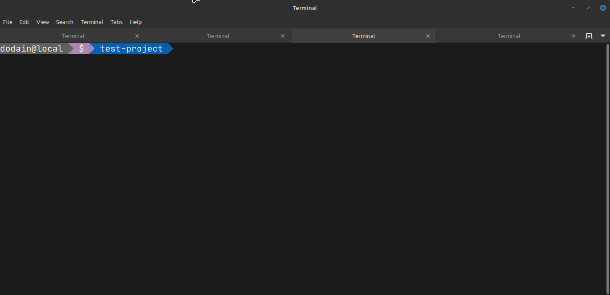

# Wollok-TS-CLI

   

🖖 Welcome to the Wollok Command Line Interface!

## 🔧 Available Commands

Wollok Command Line Interface should be run **inside a Wollok project folder**. This folder is considered as the wollok target project.

This is the list of the currently available commands:

- **`--help`**: Shows the manual with all the options
- **`--version`**: Shows the current version
- **`run <program>`**: Runs a Wollok program on the target project.
- **`test <filter>`**: Runs Wollok tests on the target project.
- **`repl <auto-import>`**: Opens the Wollok REPL on the target project importing the auto-import path (if any).
- **`init <name>`**: Creates a new Wollok project

## 💻 Installation instructions

Go to [latest release](https://github.com/uqbar-project/wollok-ts-cli/releases/latest), download the executable based on your operating system and add it to the PATH (here are instructions to do so in [Mac](https://apple.stackexchange.com/questions/41542/adding-a-new-executable-to-the-path-environment-variable), [Windows](https://medium.com/@kevinmarkvi/how-to-add-executables-to-your-path-in-windows-5ffa4ce61a53) and [Linux](https://unix.stackexchange.com/questions/183295/adding-programs-to-path)).

Or install it using [npm](https://www.npmjs.com/package/wollok-ts-cli) with the command `npm i -g wollok-ts-cli`. You must have [NodeJS](https://nodejs.org/) installed in your local machine.

Feel free to report issues on [the project's issue tracker](https://github.com/uqbar-project/wollok-ts-cli/issues).

This component is part of the [Wollok language project](https://github.com/uqbar-project/wollok-language) where you can have an overall picture of our roadmap.

## 👩‍💻 Contributing

All contributions are welcome!

- See [installation instructions for developers](https://github.com/uqbar-project/wollok-ts-cli/wiki/Developer-Environment)
- You can also [join the Discord channel!](https://discord.gg/ZstgCPKEaa)
- There's a list of [good first issues](https://github.com/uqbar-project/wollok-lsp-ide/issues?q=is%3Aissue+is%3Aopen+label%3A%22good+first+issue%22) to tackle, but in case of any hesitation you can always ping @PalumboN or @fdodino
- You can fork the project and [create a *Pull Request*](https://help.github.com/articles/creating-a-pull-request-from-a-fork/). If you've never collaborated with an open source project before, you might want to read [this guide](https://akrabat.com/the-beginners-guide-to-contributing-to-a-github-project/)
- Additional info is available at the [wiki](https://github.com/uqbar-project/wollok-ts-cli/wiki)

#### Powered by [Uqbar](https://uqbar.org/)
